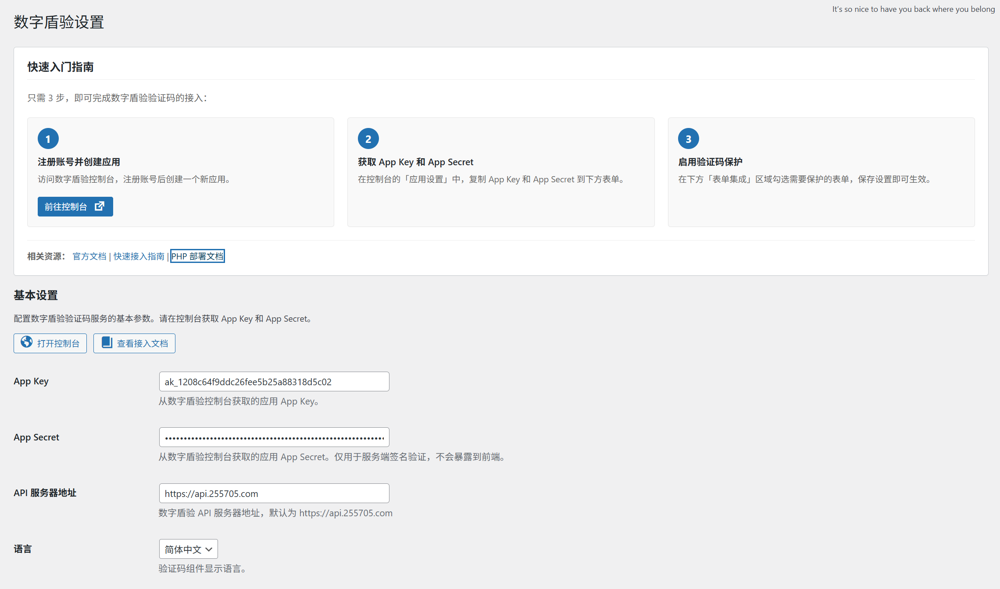
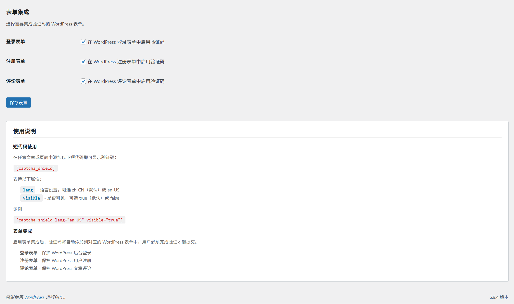
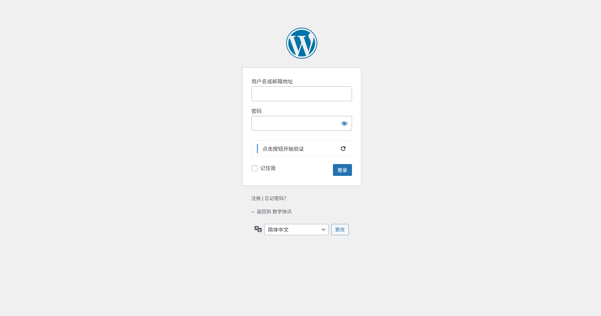
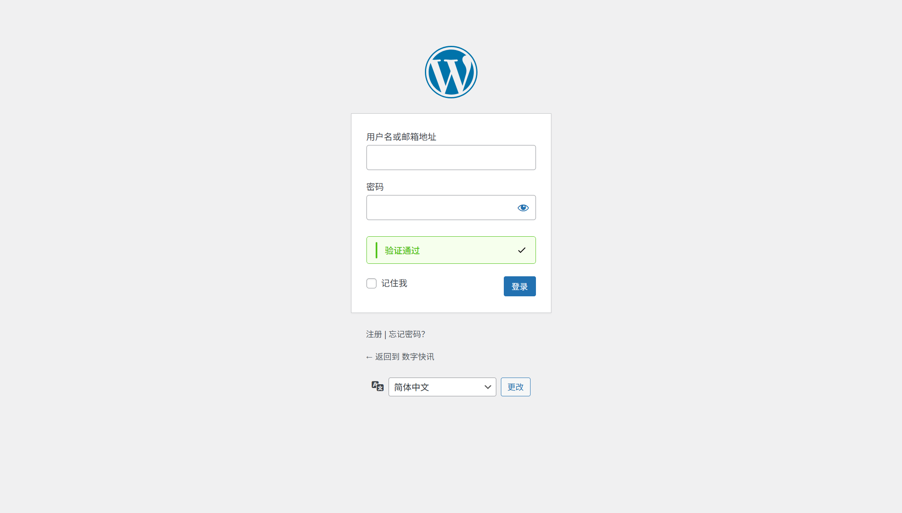
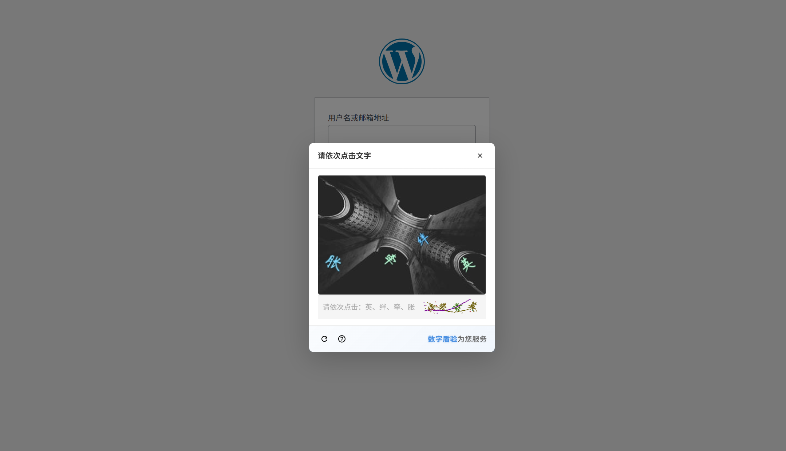

# 数字盾验 WordPress 验证码插件

[](https://wordpress.org/)
[](https://php.net/)
[](https://www.gnu.org/licenses/gpl-2.0.html)

一款专为 WordPress 开发的企业级智能验证码插件，集成[数字盾验](https://255705.com/)安全服务，为您的网站提供全方位的安全防护，有效防止自动化攻击、恶意注册、刷单等行为。

## ✨ 功能特性

- 🔐 **多种验证码类型** - 支持一键验证、滑动拼图、文字点选、旋转验证、图标点选、拖拽验证
- 🤖 **智能风控系统** - 自动识别风险用户，动态调整验证难度
- 📝 **表单集成** - 支持 WordPress 登录、注册、评论表单验证码保护
- 🎯 **短代码支持** - 使用 `[captcha_shield]` 短代码在任意页面插入验证码
- 🌍 **多语言支持** - 支持简体中文和英文
- 🔒 **安全验证** - 后端 HMAC-SHA256 签名验证，App Secret 绝不暴露到前端
- ⚡ **按需加载** - CDN 脚本仅在需要验证码的页面加载，不影响网站性能
- 📱 **响应式设计** - 完美适配桌面端和移动端

## 📸 插件截图


*图 1：插件设置页面，包含快速入门指南和配置选项*


*图 2：WordPress 登录表单集成验证码*


*图 3：WordPress 注册表单集成验证码*


*图 4：WordPress 高风险环境二次弹出验证*


*图 5：在文章中使用短代码插入验证码*

## 📋 系统要求

- WordPress 5.2 或更高版本
- PHP 7.2 或更高版本
- 有效的数字盾验账号（[免费注册](https://255705.com/console)）

## 🚀 快速开始

### 安装插件

#### 方法一：通过 WordPress 后台安装

1. 下载插件 ZIP 文件
2. 登录 WordPress 后台，进入「插件 > 安装插件」
3. 点击「上传插件」按钮，选择下载的 ZIP 文件
4. 点击「立即安装」，然后激活插件

#### 方法二：手动安装

1. 下载插件文件并解压
2. 将 `captcha-shield` 文件夹上传到 `/wp-content/plugins/` 目录
3. 登录 WordPress 后台，进入「插件」页面激活插件

### 配置插件

1. **注册账号并创建应用**
   - 访问 [数字盾验控制台](https://255705.com/console)
   - 注册账号并创建新应用
   - 获取 App Key 和 App Secret

2. **配置插件**
   - 在 WordPress 后台点击「设置 > 数字盾验」
   - 填写 App Key 和 App Secret
   - 选择需要保护的表单（登录/注册/评论）
   - 保存设置

3. **完成！**
   - 验证码将自动添加到启用的表单中

## 📖 使用说明

### 短代码

在文章或页面中使用短代码插入验证码：

```
[captcha_shield]
```

支持自定义属性：

```
[captcha_shield lang="en-US" visible="true"]
```

| 属性 | 说明 | 可选值 | 默认值 |
|------|------|--------|--------|
| `lang` | 语言设置 | `zh-CN`, `en-US` | `zh-CN` |
| `visible` | 是否可见 | `true`, `false` | `true` |

### 表单集成

在插件设置页面启用以下表单保护：

- **登录表单** - 保护 WordPress 后台登录页面
- **注册表单** - 保护 WordPress 用户注册页面
- **评论表单** - 保护 WordPress 文章评论功能

### API 配置

| 配置项 | 说明 | 默认值 |
|--------|------|--------|
| App Key | 应用标识 | - |
| App Secret | 应用密钥（仅服务端使用） | - |
| API 服务器地址 | 数字盾验 API 地址 | `https://api.255705.com` |
| 语言 | 验证码显示语言 | `zh-CN` |

## 🔧 高级配置

### 验证码类型

数字盾验支持以下验证码类型，可在控制台配置：

| 类型 | 代码 | 适用场景 |
|------|------|----------|
| 一键通过 | `one_click` | 低风险场景、快速验证 |
| 滑动拼图 | `slide` | 中等风险场景 |
| 文字点选 | `click` | 高风险场景 |
| 旋转验证 | `rotate` | 中等风险场景 |
| 图标点选 | `click_icon` | 高风险场景 |
| 拖拽验证 | `drag` | 中等风险场景 |

### 智能二次验证

当用户选择「一键通过」验证时，系统会自动进行 AI 风控检测：

- **安全用户**：直接通过验证
- **可疑用户**：根据风险分数自动触发二次验证
- **高风险用户**：直接拦截验证请求

## 🛡️ 安全说明

- **App Secret 保护**：仅用于服务端签名验证，绝不暴露到前端代码
- **Nonce 验证**：所有 AJAX 请求验证 WordPress Nonce，防止 CSRF 攻击
- **输入清理**：所有用户输入使用 WordPress 清理函数处理
- **输出转义**：所有输出使用 WordPress 转义函数处理
- **签名验证**：使用 HMAC-SHA256 算法验证验证码签名

## 🌐 国际化

本插件支持国际化，可通过翻译文件进行本地化：

- 默认语言：简体中文
- 文本域：`captcha-shield`
- 翻译文件位置：`languages/`

## 📝 更新日志

### 1.0.0
- 初始版本发布
- 支持数字盾验验证码服务
- 支持 WordPress 登录、注册、评论表单保护
- 支持短代码插入验证码
- 支持多语言（中文/英文）

## 🤝 贡献

欢迎提交 Issue 和 Pull Request！

## 📄 许可证

本插件采用 [GPL v2 或更高版本](https://www.gnu.org/licenses/gpl-2.0.html) 开源许可。

## 🔗 相关链接

- [数字盾验官网](https://255705.com/)
- [数字盾验文档](https://docs.255705.com/)
- [快速接入指南](https://docs.255705.com/start/quickstart)
- [PHP 部署文档](https://docs.255705.com/deploy/php)

## 💬 支持

如有问题或建议，请通过以下方式联系我们：

- 在 GitHub 提交 [Issue](../../issues)
- 访问 [数字盾验官网](https://255705.com/) 获取技术支持

---

**Made with ❤️ for WordPress**
